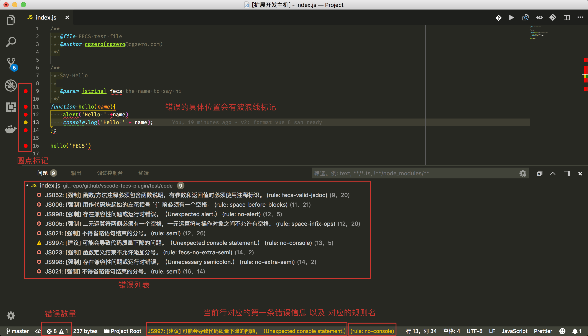
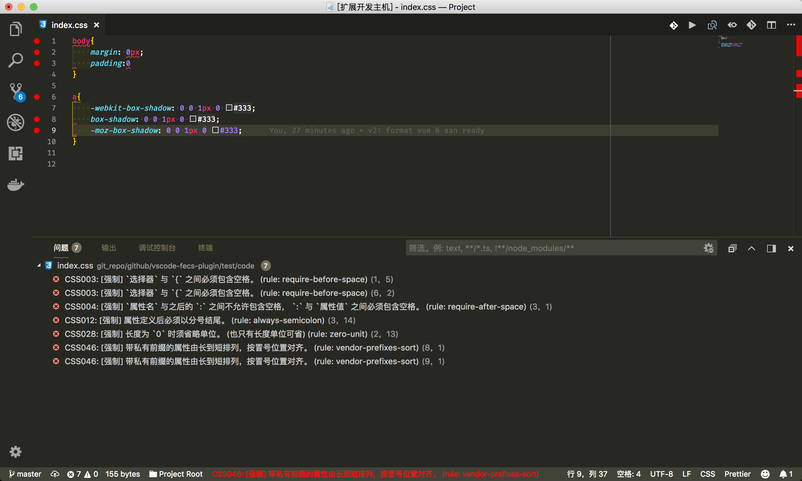
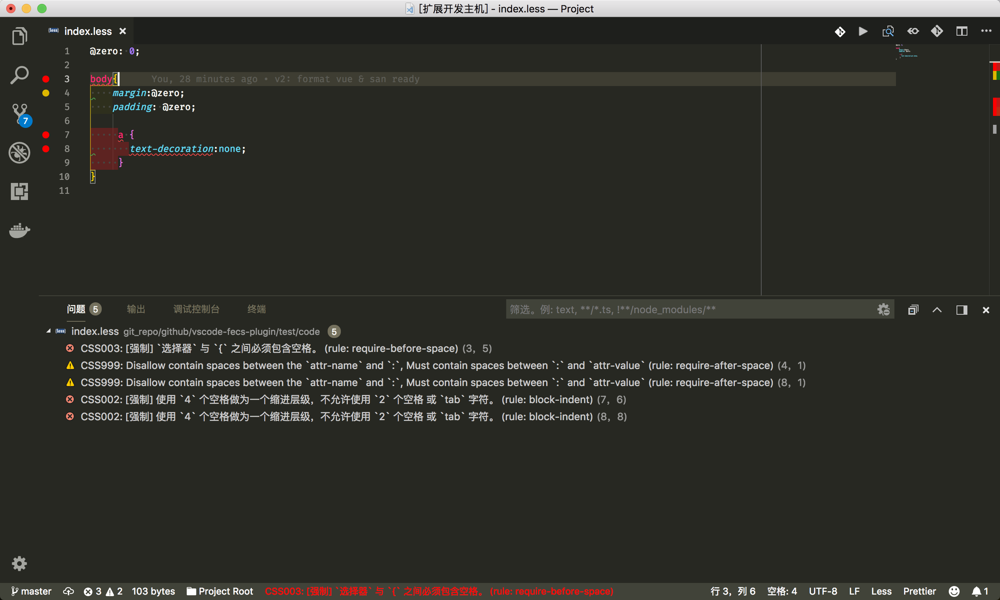
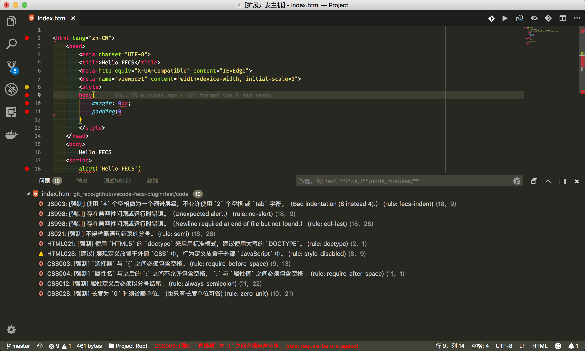

# vscode-fecs-plugin

A better fecs extension for vscode. This is inspired by [SublimeLinter-contrib-fecs](https://github.com/robbenmu/SublimeLinter-contrib-fecs) and [VScode-fecs](https://github.com/MarxJiao/VScode-fecs).

## Install

- `npm install fecs -g`
- Install [this extension](https://marketplace.visualstudio.com/items?itemName=l5oo00.vscode-fecs-plugin): `ext install vscode-fecs-plugin`

### Can't work?

Open the Developer Tools(_Help -> Toggle Developer Tools_), filter the error message by keyword `fecs`.

- [Error: Cannot find module 'fecs'](https://github.com/l5oo00/vscode-fecs-plugin/issues/4#issuecomment-312411535)
- The error message is not shown
    > **Attention:** Sometimes the error message is too long to display, maybe you need [this extension](https://marketplace.visualstudio.com/items?itemName=be5invis.vscode-custom-css) and this script([script/statusBarItemWidthFix.js](https://github.com/l5oo00/vscode-fecs-plugin/blob/master/scripts/statusBarItemWidthFix.js)).

## Features

- fecs for javascript

- fecs for css

- fecs for less

- fecs for html

- fecs for vue

> **Attention:** the gutter icon for this extension will overlap the 'debug break point' icon.

## Extension Settings

This extension contributes the following settings:

- `vscode-fecs-plugin.en`: Controls if use English in output
- `vscode-fecs-plugin.level`: Fecs check level. Value is 0 1 or 2
- `vscode-fecs-plugin.jsLikeExt`: Specified 'js like' files extension that can use fecs.
- `vscode-fecs-plugin.cssLikeExt`: Specified 'css like' files extension that can use fecs.
- `vscode-fecs-plugin.htmlLikeExt`: Specified 'html like' files extension that can use fecs.
- `vscode-fecs-plugin.excludePaths`: Uncheck the files in these directory.
- `vscode-fecs-plugin.excludeFileNameSuffixes`: Uncheck the files with these suffixes.

### For more information

* [FECS](http://fecs.baidu.com/)

**Enjoy!**
